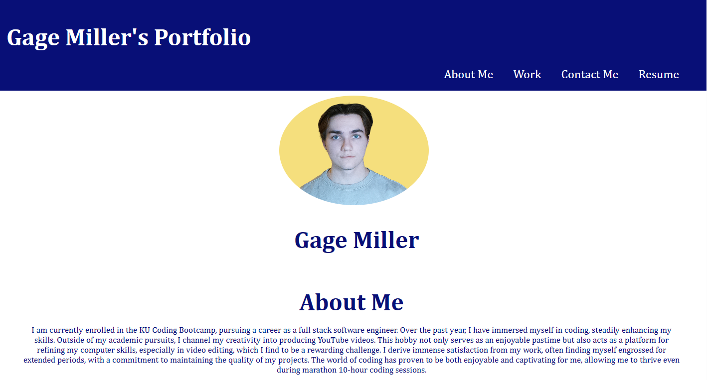

# <KU-Homework2>

## Description

My motivation behind this project was that I wanted to become more proficient at HTML and CSS whilst also building something I will use in the future. I built this project because having an impressive portfolio is very important for getting a job as a software engineer. This project is that portfolio and with this new portfolio i can work to increase how good I look to potential employers. Through this project, I have learned how important media queries can be and how CSS is the backbone of most web applications.

## Table of Contents (Optional)

## Installation

N/A

## Usage

The nav links at the top of the page will send you to the corresponding part in the body or footer. The image for the HTML CSS Code Refactor will send you to the deployed application when left clicked. At the bottom of the page, in the Resume section, if you click on "Resume" it will send you to my Resume.

## Credits

N/A

## License

N/A

## Badges

N/A

## Features

N/A

## How to Contribute

N/A

## Tests

N/A